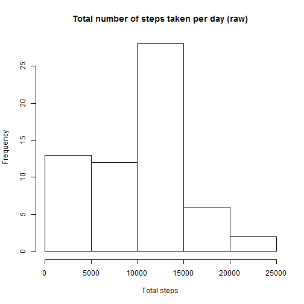
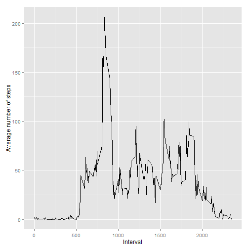
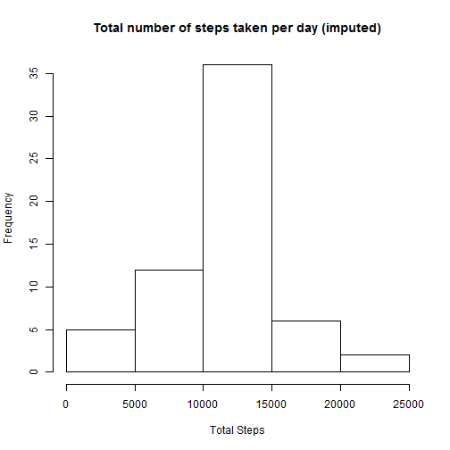
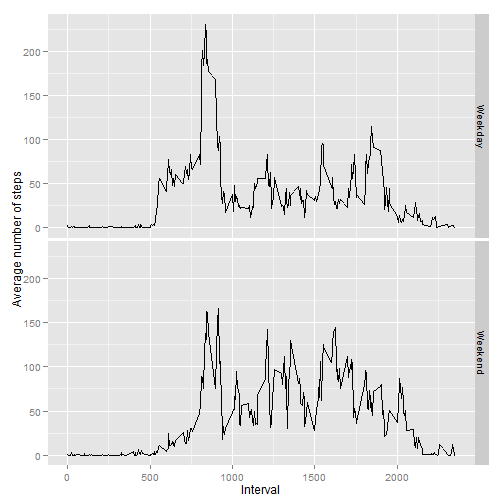

# Reproducible Research: Peer Assessment 1

It is now possible to collect a large amount of data about personal movement 
using activity monitoring devices such as a Fitbit, Nike Fuelband, or Jawbone 
Up. These type of devices are part of the "quantified self" movement - a 
group of enthusiasts who take measurements about themselves regularly to 
improve their health, to find patterns in their behavior, or because they are 
tech geeks. But these data remain under-utilized both because the raw data 
are hard to obtain and there is a lack of statistical methods and software 
for processing and interpreting the data.

This report makes use of data from a personal activity monitoring device. 
This device collects data at 5 minute intervals through out the day. The data 
consists of two months of data from an anonymous individual collected during 
the months of October and November, 2012 and include the number of steps 
taken in 5 minute intervals each day.

## Loading and preprocessing the data


```r
library(reshape2)
activity <- read.csv(unz("activity.zip", "activity.csv"))
```

## What is mean total number of steps taken per day?


```r
tsteps <- with(activity, tapply(steps, date, sum, na.rm = T))
hist(tsteps, main = "Total number of steps taken per day (raw)", xlab = "Total steps")
```

 

```r
meansteps <- format(mean(tsteps), scientific = F)
mediansteps <- format(median(tsteps), scientific = F)
```

The mean total number of steps per day is 9354.  
The median total number of steps per day is 10395.

## What is the average daily activity pattern?


```r
asteps <- with(activity, tapply(steps, factor(interval), mean, na.rm = T))
amsteps <- melt(asteps)

library(ggplot2)
g <- ggplot(amsteps, aes(x = Var1, y = value)) +
  geom_line() +
  labs(x = "Interval") +
  labs(y = "Average number of steps")
print(g)
```

 

```r
max <- amsteps$Var1[which.max(amsteps$value)]
```

The five minute interval 835, on average across all the days in the dataset, 
contains the maximum number of steps.

## Imputing missing values


```r
missing <- length(which(is.na(activity$steps)==T))
```

The total number of missing values in the dataset is 2304.

To determine the effect of missing values upon the results, a data set was 
created with the missing values replaced with the rounded mean for that 
5-minute interval.


```r
# Replacing the NA values with the rounded mean for that 5-minute interval.
library(plyr)
impute.mean <- function(x) replace(x, is.na(x), round(mean(x, na.rm = TRUE)))
activity2 <- ddply(activity, ~ interval, transform, steps = impute.mean(steps))
activity2 <- activity2[order(activity2$date), ]
tsteps2 <- with(activity2, tapply(steps, date, sum, na.rm = T))
hist(tsteps2, main = "Total number of steps taken per day (imputed)", xlab = "Total Steps")
```

 

```r
meansteps2 <- format(mean(tsteps2), scientific = F)
mediansteps2 <- format(median(tsteps2), scientific = F)
```

The mean total number of steps per day is 10766.  
The median total number of steps per day is 10762.

## Are there differences in activity patterns between weekdays and weekends?

```r
activity2$daytype <- as.factor(ifelse(weekdays(
  as.Date(activity2$date)) %in% c("Saturday","Sunday"), "Weekend", "Weekday"))

asteps2 <- aggregate(steps ~ interval + daytype, data = activity2, mean)

library(ggplot2)
g <- ggplot(asteps2, aes(x = interval, y = steps)) +
  geom_line() +
  facet_grid(daytype ~ .) +
  labs(x = "Interval") +
  labs(y = "Average number of steps")
print(g)
```

 
